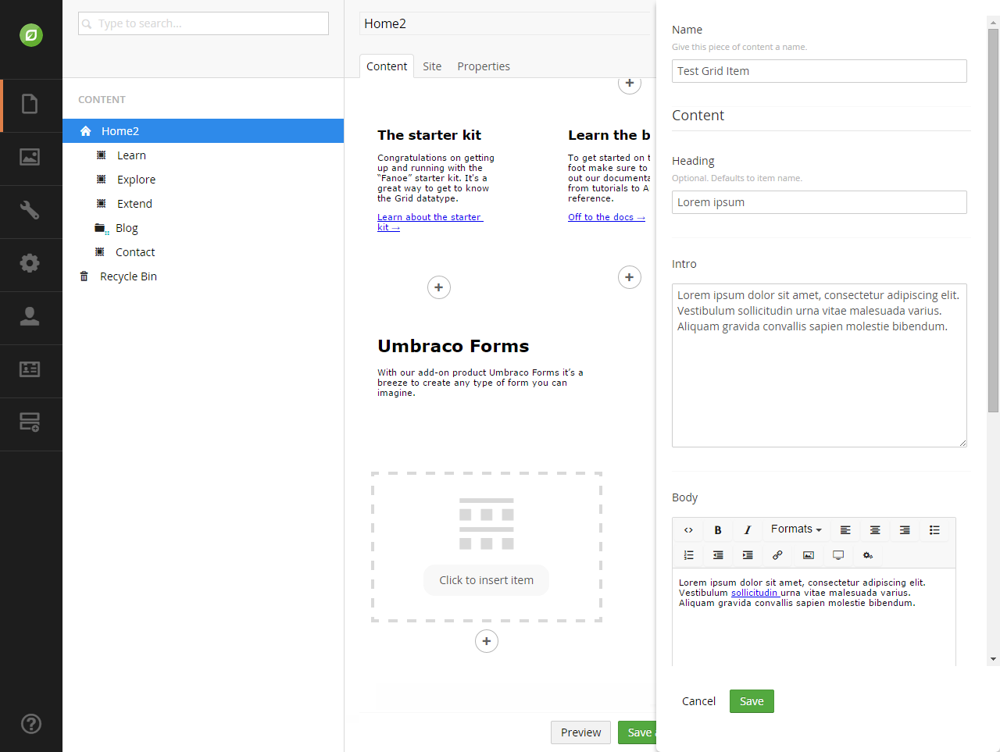

# Doc Type Grid Editor - Developers Guide

### Contents

1. [Introduction](#introduction)
2. [Getting Set Up](#getting-set-up)
  * [System Requirements](#system-requirements)
3. [Configuring The Doc Type Grid Editor](#configuring-the-doc-type-grid-editor)
4. [Hooking Up The Doc Type Grid Editor](#hooking-up-the-doc-type-grid-editor)
5. [Rendering a Doc Type Grid Editor](#rendering-a-doc-type-grid-editor)
  * [DocTypeGridEditorSurfaceController](#doctypegrideditorsurfacecontroller)
6. [Useful Links](#useful-links)

---

### Introduction

**Doc Type Grid Editor** is an advanced grid editor for the new Umbraco grid, offering similar functionality as the macro grid editor but using the full power of the doc type editor and data types.

With the macro grid editor you are limited to only using the macro builder and thus the handful of parameter editors that are available. Of course you can create / config your own parameter editors, however this is cumbersome compared to how we can configure data types.

With the **Doc Type Grid Editor** then, we bridge that gap, allowing you to reuse doc type definitions as blue prints for complex data to be rendered in a grid cell.

---

### Getting Set Up

#### System Requirements

Before you get started, there are a number of things you will need:

1. .NET 4.5+
2. Umbraco 7.2.0+
3. The **Doc Type Grid Editor** package installed

---

### Configuring The Doc Type Grid Editor

The **Doc Type Grid Editor** is configured via the grid.editors.config.js config file located in the /Config folder. A default configuration should be installed along with the package, but for details on the configuration options, please see below.

#### Example

```javascript
 1. [
 2. ...
 3. {
 4. “name”: ”Doc Type”,
 5. “alias”: ”docType”,
 6. “view”: ”/App_Plugins/../doctypegrideditor.html”,
 7. “render”: ”/App_Plugins/../doctypegrideditor.cshtml”,
 8. “icon”: ”icon-item-arrangement”,
 9. “config”: {
 10. “allowedDocTypes: [...],
 11. “enablePreview”: true,
 12. “viewPath”: “/Views/Partials/”
 13. },
 14. ...
 15. ]
```


The **Nested Content** property editor is set-up/configured in the same way as any standard property editor, via the *Data Types* admin interface. To set-up your Nested Content property, create a new *Data Type* and select **Nested Content** from the list of available property editors.

You should then be presented with the **Nested Content** property editors prevalue editor as shown below.


The prevalue editor allows you to configure the following properties.

| Member          | Type    | Description |
|-----------------|---------|-------------|
| Doc Types       | List    | Defines a list of doc types to use as data blue prints for this **Nested Content** instance. For each doc type you can provide the alias of the tab you wish to render (first tab is used by default if not set) as well as a template for generating list item labels using the syntax `{{propertyAlias}}`. |
| Min Items       | Int     | Sets the minimum number of items that should be allowed in the list. If greater than 0, **Nested Content** will pre-populate your list with the minimum amount of allowed items and prevent deleting items below this level. Defaults to 0.
| Max Itemd       | Int     | Sets the maximum number of items that should be allowed in the list. If greater than 0, **Nested Content** will prevent new items being added to the list above this threshold. Defaults to 0. |
| Confirm Deletes | Boolean | Enabling this will require item deletions to require a confirmation before being deleted. Defaults to TRUE |
| Show Icons      | Boolean | Enabling this will display the items doc type icon next to the name in the **Nested Content** list. |
| Hide Label      | Boolean | Enabling this will hide the property editors label and expand the **Nested Content** property editor to the full with of the editor window. |

Once your data type has been configured, simply set-up a property on your page doc type using your new data type and you are set to start editing.

---

### Editing Nested Content

The **Nested Content** editor takes a lot of styling cues from the new Umbraco grid in order to keep consistency and a familiarity to content editors.

When viewing a **Nested Content** editor for the first time, you’ll be presented with a simple icon and help text to get you started.


Simply click the  icon to start creating a new item in the list. 

If your **Nested Content** editor is configured with multiple doc types you will be presented with a dialog window to select which doc type you would like to use.

 

Simply click the icon of the doc type you wish to use and a new items will be created in the list using that doc type.

If you only have one doc type configured for your **Nested Content** editor, then clicking the  will not display the dialog and instead will jump straight to inserting an entry in the editor for you ready to edit.


More items can be added to the list by clicking the  icon for each additional item.

To close the editor for an item / open the editor for another item in the list, simply click the  icon.



To reorder the list, simply click and drag the  icon up and down to place the items in the order you want.

To delete an item simply click the  icon. If the minimum number of items is reached, then the  icon will appear greyed out to prevent going below the minimum allowed number of items.

#### Single Item Mode

If **Nested Content** is configured with a minimum and maximum item of 1, then it goes into single item mode.

In single item mode, there is no icon displayed to add new items, and the single items editor will be open by default and it’s header bar removed.

In this mode,** Nested Content** works more like a fieldset than a list editor.


---

### Rendering Nested Content

To render the stored value of your **Nested Content** property, a built in value convert is provided for you. Simply call the `GetPropertyValue<T>` method with a generic type of `IEnumerable<IPublishedContent>` and the stored value will be returned as a list of `IPublishedContent` entity.

Example:

```csharp
@inherits Umbraco.Web.Mvc.UmbracoViewPage
@{
	var items = Model.GetPropertyValue<IEnumerable<IPublishedContent>>("myProperyAlias");

	foreach(var item in items)
	{
		// Do your thang...
	}
}
```

Because we treat each item as a standard `IPublishedContent` entity, that means you can use all the property value converters you are used to using, as-well as the built in `@Umbraco.Field(...)` helper methods.

Example:
```csharp
@inherits Umbraco.Web.Mvc.UmbracoViewPage
@{
	var items = Model.GetPropertyValue<IEnumerable<IPublishedContent>>("myProperyAlias");

	foreach(var item in items)
	{
		<h3>@item.GetPropertyValue("name")</h3>
		@Umbraco.Field(item, "bodyText")
	}
}
```

#### Single Item Mode

If your **Nested Content** property editor is configured in single item mode then the value converter will automatically know this and will return a single `IPublishedContent` entity rather than an `IEnumerable<IPublishedContent>` list. Therefore, when using **Nested Content** in single item mode, you can simply call `GetPropertyValue<T>` with a generic type of `IPublishedContent` and you can start accessing the entities property straight away, rather than having to then fetch it from a list first.

Example:
```csharp
@inherits Umbraco.Web.Mvc.UmbracoViewPage
@{
	var item = Model.GetPropertyValue<IPublishedContent> ("myProperyAlias");
}
	<h3>@item.GetPropertyValue("name")</h3>
	@Umbraco.Field(item, "bodyText")
```

---

### Useful Links

* [Source Code](https://github.com/leekelleher/umbraco-doc-type-grid-editor)
* [Our Umbraco Project Page](http://our.umbraco.org/projects/backoffice-extensions/doc-type-grid-editor)
